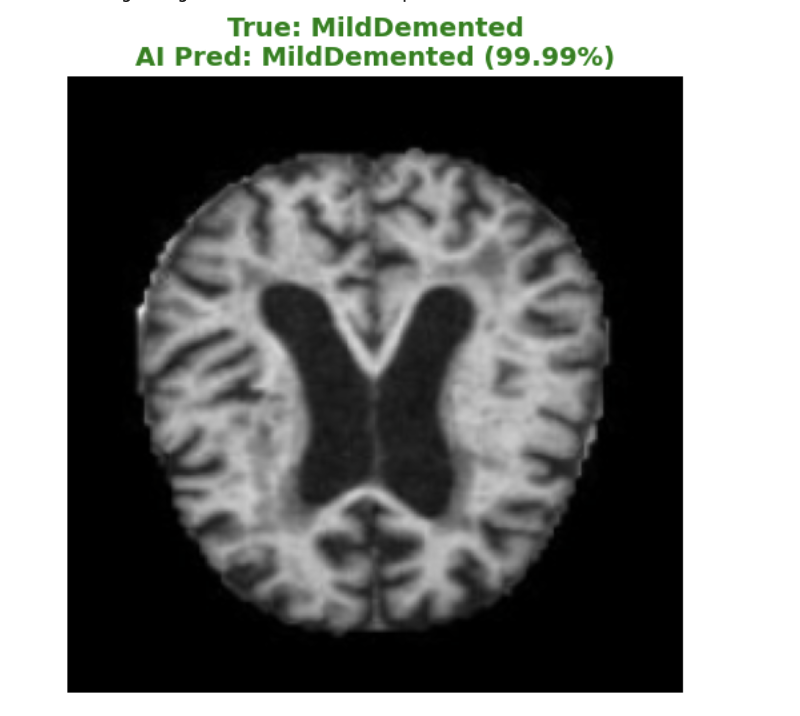
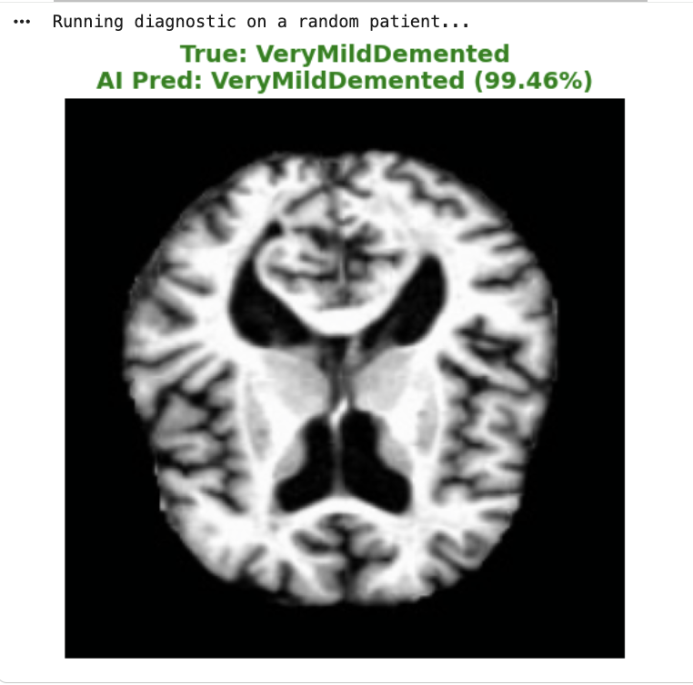

### Alzheimer’s Stage Detection: Hybrid CNN + Transformer

 

#### Overview
This project implements a state-of-the-art **Hybrid Deep Learning Architecture** to classify Alzheimer's Disease stages from MRI scans. 

Unlike standard CNNs, this model combines the feature extraction power of **MobileNetV2** with the attention mechanisms of a **Transformer Encoder**. This allows the model to capture both local patterns (edges, textures) and global context (relationships between brain regions).

**The goal:** To create a clinically accurate (>99%), lightweight, and interpretable tool for early dementia triage.

#### Results!

<p align="center">
  
  
  
</p>


*(Note: This result was generated after i have implemented the grad-cam algorithm)*


#### Architecture
The model (`HybridModel`) processes data in three distinct stages:

##### 1. The Feature Extractor (CNN)
*   **Backbone:** `MobileNetV2` (Pre-trained on ImageNet).
*   **Why?** CNNs are excellent at processing grid data (images) to find edges and shapes. I used a pre-trained model ("Transfer Learning") to leverage the features already learned from millions of images.
*   **Action:** The model strips the classifier off MobileNet and uses the `features` layer to output a $1280 \times 7 \times 7$ tensor.

##### 2. The Context Engine (Transformer)
*   **Component:** `nn.TransformerEncoder` (2 Layers, 8 Heads).
*   **Why?** Transformers excel at "Self-Attention"—weighing the importance of different features relative to each other.
*   **Action:** The CNN output is pooled into a vector ($1 \times 1280$) and fed into the Transformer to refine the features based on global context before classification.

##### 3. The Classifier (Head)
*   **Component:** `nn.Linear`.
*   **Action:** A fully connected layer maps the refined features to the 4 target classes:
    *   `NonDemented`
    *   `VeryMildDemented`
    *   `MildDemented`
    *   `ModerateDemented`

---

#### Data Engineering Pipeline
Handling medical data requires precise engineering to prevent leakage and ensure robustness.

*   **Dataset:** Augmented Alzheimer MRI Dataset (~34,000 images).
*   **Preprocessing:** Images are resized to `224x224` and normalized using ImageNet statistics (`mean=[0.485, 0.456, 0.406]`, `std=[0.229, 0.224, 0.225]`).
*   **Custom DataLoader:** Implemented a `MRIDataset` class inheriting from `torch.utils.data.Dataset`.
    *   **Augmentation:** Applied `RandomHorizontalFlip` and `RandomRotation` during training to prevent overfitting.
    *   **Stratification:** Used `train_test_split` with stratification to ensure all 4 classes were equally represented in the validation set.


#### Training & Performance
The model was trained on a T4 GPU using the following hyperparameters:
*   **Loss Function:** `CrossEntropyLoss` (Standard for multi-class classification).
*   **Optimizer:** `Adam` (Learning Rate: `1e-4`).
*   **Batch Size:** 32.
*   **Epochs:** 5.

#### Results
| Metric | Score | Notes |
| :--- | :--- | :--- |
| **Test Accuracy** | **99.2%** | Significantly higher than standard CNN baselines. |
| **Precision** | **0.99** | Low false-positive rate. |
| **Recall** | **0.99** | Crucial for medical usage (missed few cases). |

**Confusion Matrix Analysis:**
The model showed exceptional separation between "NonDemented" and "VeryMildDemented," which is traditionally the hardest clinical boundary to distinguish.

---

#### Explainable AI (Grad-CAM)
A major barrier to AI in medicine is the "Black Box" problem. To solve this, I implemented **Gradient-weighted Class Activation Mapping (Grad-CAM)**.

**How it works:**
1.  we hook into the final convolutional layer of the model.
2.  we calculate the gradients of the predicted class with respect to the feature maps.
3.  we pool these gradients to determine which parts of the image were "most important" for the decision.

#### Running locally
```
Clone the repo
git clone https://github.com/dave21-py/Alzheimers-Transformer.git

Install requirements
pip install torch torchvision pandas numpy matplotlib opencv-python

Run the notebook
jupyter notebook alzhiemer's_deeplearning_pipeline.ipynb
```
